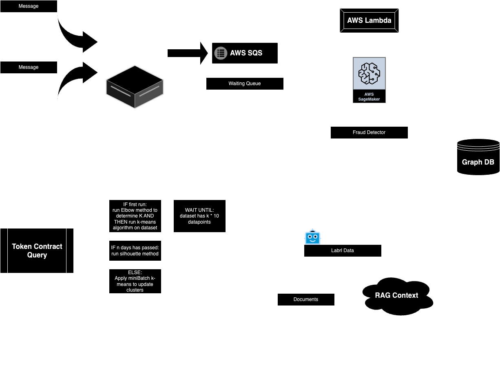

# Flow-Forge

### Description
This project aims to provide an end-to-end solution for tracking, analyzing, and classifying blockchain token transactions to identify potential fraudulent activity and understand token flow. Leveraging AWS Kinesis, AWS Lambda, AWS SQS, and Neo4j, the project processes blockchain events in real-time and applies machine learning models for fraud detection.

Key features include:

- Real-time Event Processing: Streams blockchain events using AWS Kinesis and batches them for processing.

- Fraud Detection: Uses AWS SageMaker to apply an ML model for identifying potential fraud.

- Graph-based Analysis: Stores relationships in Neo4j for visual tracking of token movement and relationships.

- Incremental Clustering: Applies K-means clustering to group transactions and identify patterns over time.

- Interactive Analysis: Labels generated by a language model (LLM) offer human-readable insights into token groups, enabling an intuitive understanding of the token ecosystem.

The project provides a robust system for blockchain stakeholders to monitor token flows, detect anomalies, and maintain transparency in their token networks.

